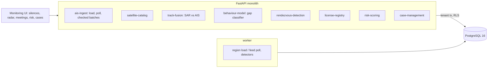

# Global Fisheries Monitoring & Illegal Fishing Detection

For a fisheries monitoring centre: it takes AIS as it is really received (patchy offshore, worse in some places, with transponders
that fail on their own), radar satellite passes and the licence registry, and asks which silences were on purpose, which radar
targets have no AIS and who they could have been, which carriers met someone at sea, and which boats to look at first; then it
freezes the evidence into a case that a second person must approve before anyone is sent to sea.

Built from blueprint 15 of "Advanced Engineering Build Book, Volume IV" as a **vertical slice**: the demo scenario end to end, with
the platform parts real and the rest listed under [Not built](#not-built-and-why).

**The region, the fleet, its tracks, the AIS reception, the radar passes, the registry and who broke the rules are generated by a
simulator in this repository. No real vessel, MMSI, registry, AIS or satellite data is used. The detectors only see what a centre
would (received AIS, SAR detections, the registry); the generator's truth is used to train on past cases (other simulated
fortnights) and to score. The simulated rule-breakers behave more distinctly than real ones, so every number here is a best case.**

## Run it

```bash
docker compose up --build        # migrates, seeds, serves http://localhost:8370/ui/ with one worker
docker compose run --rm test     # 10 tests against a throwaway database
```

Open http://localhost:8370/ui/ and press **Run all steps** (about 30 seconds), or `make bootstrap demo`.
Demo tokens (local only): `coast-supervisor-demo`, `coast-analyst-demo`, `coast-viewer-demo`. Run `make reset` before a second demo run.

## The demo, step by step

1. **A reserve, a fleet and twelve days of AIS.** An invented 400 x 300 km region off a coast with two ports: 110 fishing boats
   (82 licensed), four reefer carriers, eight cargo ships, and the Coral Bank Marine Protected Area over the best fishing ground.
   133,731 AIS messages as received (74% of messages get through near the coast, 61% offshore, 31% in the east) and 783 SAR
   detections. The gap and risk models were trained on past cases from three other simulated fortnights (1,680 silences, 48
   deliberate; 330 boats, 33 rule-breakers). Over twelve days 82 fishing boats crossed the reserve on AIS, none at fishing speed;
   the radar saw 67 targets inside it, 8 with no AIS.
2. **Two more days, and a batch that does not add up.** The last 48 hours arrive (21,552 messages, four SAR passes) and every
   detector runs again. A partner feed sends five fixes: one is fine, one would put Morning Tide 3 150 km from its last fix (935
   knots) and is kept but flagged and left out of the detectors, and three are refused (unknown MMSI, no timezone, in the future).
3. **What the silences, the radar and the meetings say.** 108 silences of two hours or more in 48 hours. The six-hour rule flags
   33; the gap model flags 3. One of them is deliberate: Southern Star 7, silent for 22.3 hours from 8 km west of the reserve.
   The other two, Morning Tide 6 and Blue Heron 2, are honest boats whose transponders failed near the reserve and look the same.
   19 radar targets had no AIS; each lists the silent boats that could have been there. Carriers loitered offshore with no AIS
   partner five times; once, Polar Crown had a 20 m radar target alongside at 18:00. The distance-only rule raised 21 meetings, led by
   the pair trawlers Bay Sister 1 and 2.
4. **Southern Star 7.** The radar target inside the reserve at 06:00 could have been any of three silent boats, and the ranking
   even puts Morning Tide 6 first. What settles it is 18:00: a 20 m target alongside Polar Crown that only Southern Star 7 could
   have reached. On this last day the satellite passes are aimed at the reserve and at the carrier, so the demo boat is always
   detected; the held-out evaluation does not force this. The risk model ranks it 5th of 110 (worst silence +3.35, prior violation +1.81, likely partner of a loitering
   carrier +0.65); its top ten holds 7 of the 12 rule-breakers, against 3 for a ranking by silent hours.
5. **A case, and a second pair of eyes.** The analyst opens a case; the evidence (the silence, five radar targets it could have
   been, the meeting, the risk contributions, the registry) is frozen into it with its SHA-256. The same analyst cannot escalate it;
   a supervisor requests an at-sea inspection. Every step is in a hash-chained audit log.

## Architecture



| Piece | How it works |
|---|---|
| Simulator (`fw/world.py`) | Itineraries rendered at 10-minute steps for 14 days: trips from port to four fishing grounds (one beside the reserve, one in the poorly covered east), slow turning walks while fishing that turn back 1.5 km before the reserve, pair trawlers, carriers making port calls and waiting offshore, cargo ships crossing and leaving. About a dozen boats break the rules (more likely if unlicensed, on an open registry or in two owner networks): they switch AIS off 8 to 45 km out and fish inside the reserve, or meet a carrier at sea (six in ten dark). Four honest boats transship with a declared authorisation. AIS reception per message is 92% near the coast, 60% offshore and 12% in the east, and 4.5% of boat-days have a transponder failure of 3 to 16 hours. SAR passes at 06:00 and 18:00 over a 160 km swath detect 92%, 70% or 40% of vessels by size, with 300 m position error, a noisy length, and wave clutter. |
| Coverage | Received over expected messages per 20 km cell, from silences under six hours in the data itself. |
| Gap model | Every silence of two hours or more: log-probability of that silence under the cell's coverage along the straight path, its length, nearness to and crossing of the reserve, the knots it implies, whether a loitering carrier was reachable, whether it ends at the region's edge, vessel type. Logistic regression trained on past cases. |
| Fusion | SAR detections matched to AIS-predicted positions (interpolated within two hours) by the Hungarian algorithm, gated at 3 km and on length; unmatched targets of 18 m or more are dark targets. Attribution: boats silent at the time that could have been there at 15 knots from the last fix and to the next, of a compatible length, ranked by their silence's score. |
| Meetings | An AIS encounter is a carrier and a fishing boat both under 2 knots within 1 km for two hours, over 20 km from port; declared ones are set aside. A dark meeting candidate is a carrier loitering under 2 knots for three hours over 30 km from port with no AIS partner; partners are silent boats that could have been there in the last two hours of the loitering (a carrier leaves when loading is done), corroborated if a dark radar target lies within 2 km. |
| Risk | Logistic regression per fishing boat over the fortnight: worst silence score, dark radar targets near the reserve attributed to it, undeclared carrier encounters, being a loitering carrier's likely partner, unlicensed, open registry, prior violation, owner with a violation elsewhere. Each factor's contribution to the log-odds is returned. |
| Platform | Row-level security per centre, Postgres job queue, Idempotency-Key replay, hash-chained audit log, `/metrics`. |

## Data model

`migrations/002_fisheries.sql` follows the blueprint (vessel, identity, track_point, satellite_detection, license, protected_area,
behavior_event, rendezvous, risk_score, case); the blueprint's `case` table is `cases` because CASE is reserved in SQL. Additions
are marked `(+)`: the region and its clock, vessel sequence numbers, prior violations on the licence, declared transshipment
authorisations, the case's frozen evidence and its hash, escalation.

## API

| Method | Endpoint | Purpose |
|---|---|---|
| POST | `/v1/tracks/ingest` | AIS fixes from a partner feed, each checked; impossible jumps kept but flagged |
| GET | `/v1/vessels/{id}/timeline` | Identity, licence, fixes, silences, radar targets it could have been, meetings, risk |
| POST | `/v1/risk/score` | Every fishing boat scored with each factor's contribution, beside a ranking by silent hours |
| GET | `/v1/events/suspicious` | Silences scored, dark radar targets with candidates, meetings, beside the simple rules' counts |
| POST | `/v1/cases` | A case with its evidence frozen and hashed |
| GET | `/v1/areas/{id}/activity` | Inside and around the reserve |
| POST | `/v1/region:load` · `/v1/tracks:poll` | (+) 202 + job: load the region; the feeds deliver the next hours |
| POST | `/v1/cases/{id}/escalate` | (+) An action outside the centre; a supervisor who did not open the case |

Contract: [`docs/openapi.json`](docs/openapi.json).

## Measured

[`docs/evaluation.md`](docs/evaluation.md) (`python -m fw.evaluate`, three fortnights the models never trained on) and
[`docs/performance.md`](docs/performance.md).

| Detector | Result | Simple rule |
|---|---|---|
| Deliberate silences, gap model over 0.5 | precision 0.50–0.85, recall 0.29–0.69, under one alert a day | |
| Deliberate silences, gap model over 0.2 | precision 0.52–0.55, recall 0.86–1.00, about two alerts a day | any silence of 6 h: precision 0.08, recall 0.94–1.00, twelve alerts a day |
| Radar targets with no AIS | 59–67% are real vessels (the rest wave clutter); 7–10 deliberately dark boats seen per fortnight, the right boat named first for 5–6 of them | |
| Undeclared transshipments | 5–7 of 5–8 found (carrier and time right); AIS encounters 1–3, all real | distance only: 133–168 meetings, 1–3 real |
| Loitering carriers as dark meetings | 19–23 flagged per fortnight, 3–6 real, partner named first for 1–4 | |
| Ranking the fleet | top ten holds 7–10 rule-breakers, AUC 0.96–1.00 | by silent hours: 4–6, AUC 0.69–0.88 |

What these numbers say plainly. The gap model's value is workload: it reaches nearly the six-hour rule's recall with a sixth of the
alerts, but at a usable threshold about half its alerts are honest boats whose transponders failed near the reserve. Radar alone
rarely names a boat: most dark targets have several silent candidates, and the 06:00 target in the demo is ranked wrong. Most
loitering carriers are only waiting. And the risk ranking is good because the simulated rule-breakers do several distinctive things
at once; real ones are fewer, quieter and better at it.

## The hardest tradeoff

What a silence is evidence of. Every boat goes quiet: coverage in the east is poor, transponders fail, cargo ships leave the area.
Treating every long silence as suspicious buries the few deliberate ones under a dozen alerts a day, and treating none of them as
suspicious misses the point of the system. So a silence is scored against how likely it was given where the boat was, and against
what else was happening (the reserve, a loitering carrier), and the centre's attention goes where independent signals agree: a
silence, a radar target that only one boat could have been, a carrier with a target alongside. Any one alone is weak, as the demo
shows; the case is opened on the combination, and an at-sea action needs a second person.

## Threat model (summary)

| Threat | Mitigation here | Gap |
|---|---|---|
| Spoofed or corrupted AIS steering the detectors | Unknown MMSIs, missing timezones, future times and positions outside the region refused; fixes implying more than 35 knots kept but flagged and left out | No cross-check of identity against the radar's length beyond the fusion gate |
| Acting on a weak signal | The case freezes all evidence with a SHA-256; escalation outside the centre needs a supervisor who did not open the case | No legal review step |
| One centre seeing another's data | Row-level security on every table; tested through the API and in the database | |
| Tampering with the record | Hash-chained, append-only audit log | |

## Not built, and why

- **A trajectory sequence model**: the gap and meeting detectors use engineered features over silences; a sequence model needs far more labelled tracks than past investigations provide.
- **A SAR or optical vessel detector**: detections arrive as points with a length, as a commercial feed would deliver them.
- **An ownership-network graph model**: the registry's owner network enters as one feature; it did not help in the simulated data.
- **Real AIS, satellite or registry feeds, Kafka, Flink, PostGIS, a tile map**: synthetic data so every finding can be checked against the truth; positions are kilometres on a plane.
- **Kubernetes, Terraform, CI, SSO, a Next.js front end**: not needed to prove the slice; no cloud account used.

## Commercial sketch

Buyer: fisheries agencies, coast guards, regional fisheries management organisations, seafood buyers checking their supply.
Pricing shape from the blueprint: by ocean area or vessel coverage, with case management seats.

## Layout

```
core/        platform kit: db + RLS, jobs, audit chain, HTTP, scenario runner, load test
fw/          world (sea, fleet, AIS, SAR, truth), engine (coverage, gaps, fusion, meetings, risk), api, seed, evaluate
migrations/  forward-only SQL          web/   UI, scenario.json, demo.json (recorded run)
tests/       10 tests                  docs/  evaluation.md, performance.md, openapi.json
```
